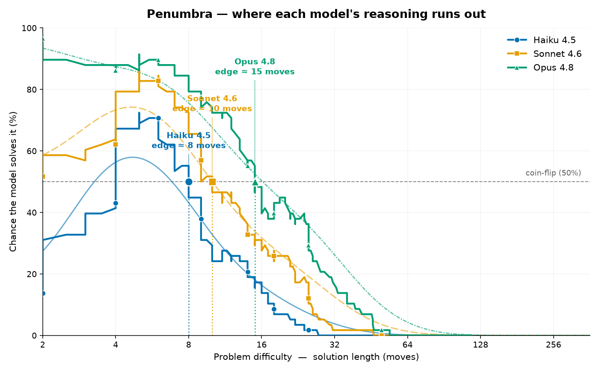

# Penumbra Round R1: Locating the Boundary of Reliable Reasoning in Three Language Models with a Contamination-Proof Procedural Benchmark

## Abstract

Penumbra Round R1 evaluated three language models, Haiku 4.5, Sonnet 4.6, and Opus 4.8, on 500 procedurally generated reasoning problems (356 solvable, 144 unsolvable across 11 families), administered zero-shot through the Message Batches API. Each problem is a deterministic function of a secret seed and never existed before evaluation time, which removes the possibility of memorization. The design pushes problems outside the training distribution to expose weak spots while measuring competence that transfers to real work: every family instantiates a reasoning primitive such as search, invariant detection, constraint solving, or adversarial planning. The report measures difficulty-calibrated ability, the solution length at which solve rate descends through 50%, and discrimination d', the ability to recognize impossibility. Opus leads on both axes, with a calibrated edge near 15 moves, a 55% true solve rate, and d' of 3.62, against Sonnet (edge near 10, 39%, d' 3.51) and Haiku (edge near 8, 24%, d' 1.72). The anti-prior Mach family compresses this ladder to 24%, 24%, and 28%, erasing the usual Opus advantage when physical priors are violated.

## 1. Introduction and Thesis

Penumbra is a procedurally generated benchmark designed to identify the point at which a language model's reasoning ceases to be reliable. The central claim of this report is that a contamination-proof, procedurally generated benchmark can locate where a model's reasoning runs out, and can do so on tasks that, while abstract, instantiate real reasoning primitives. Round R1 evaluated three models, Haiku 4.5, Sonnet 4.6, and Opus 4.8, on the same 500 problems, zero-shot, through the Message Batches API. The results support the claim along two axes at once: they separate the models cleanly by calibrated ability, and they expose specific families of reasoning, including anti-prior physics and compositional tasks, where that separation collapses.

The construction procedure makes this measurement defensible. Each problem in Penumbra is a deterministic function of a secret seed: a single operation, unfold(seed), constructs the full instance on the spot from that seed together with a fixed code version and configuration version. The reproducibility triple for R1, recorded as seed_commit `48321975122d61baf39401aafbfc5d2474663de4be12219315af10fcaec50985`, code_version `882c1bd33c259899a00068df61280fdd7f9cefac`, and config_version `10554b0ffeb416644b00c37a9fcde06341aaa1ea8d6782524a2351bfced7a036`, lets the entire round be regenerated exactly while the seed itself remains private. The model at evaluation time sees only world.to_prompt(), which contains the rules and the current state. It never sees the witness, a known solution, nor the certificate, the impossibility proof.

Contamination resistance follows directly from this design and matters because it removes the principal confound in benchmark scores. The instances evaluated in R1 never existed before evaluation time, so there is nothing on the internet to memorize and no prior exposure that could inflate a result. A model that succeeds must solve the problem in front of it. This property is reinforced by witness-first generation: a solution is planted first and the world is built around it, so every problem labeled solvable provably has a solution, and every problem labeled unsolvable ships a linear-time impossibility certificate. Of the 500 problems, 356 are solvable and 144 are unsolvable, the latter constituting 28.8% of the round. Ground truth is therefore exact rather than inferred. The construction also exploits a verify/solve gap: solutions are cheap to verify in polynomial time but expensive to find, and a random-move baseline fails the great majority of problems, so a correct answer reflects search and reasoning rather than chance.

The goal of R1 was to push as far outside the training distribution as the construction permits, in order to expose weak points, while measuring a competence that transfers to real work. The family structure holds the two objectives together. The eleven families are abstract and invented, yet each is an instance of a real reasoning primitive: search, invariant detection, induction, planning, constraint solving, adversarial game play, and spatial packing. Distance from the training distribution is created deliberately, most pointedly in the anti-prior families. The Mach family, for example, uses familiar physics vocabulary such as gravity, bodies, and engines while wiring the underlying law to be non-standard, so that memorized priors mislead rather than assist. The transfer claim is anchored at the other end of the distribution by Sluice, a flow-network family that is the most in-distribution of the set and that the stronger models nearly saturate, with solve rates of 75%, 100%, and 100% for Haiku, Sonnet, and Opus respectively. Sluice serves as the control: it shows that the models can execute these primitives when the framing is familiar, which means failures elsewhere are attributable to the reasoning demand and not to the abstract presentation.

Because accuracy alone conflates ability with the difficulty mix of a particular round, the report does not lead with a single accuracy figure. The primary measure is a difficulty-calibrated edge, defined as the solution length in moves at which a model's solve rate descends through 50%, read off the empirical ability curve. This is the Item-Response-Theory notion of ability, under which solving a harder item counts for more, and it is invariant to how many easy or hard problems the round happens to contain. On this measure the three models order as expected, with calibrated edges of roughly 8, 10, and 15 moves for Haiku, Sonnet, and Opus, alongside true solve rates of 24%, 39%, and 55% on the 356 solvable problems. A second measure, discrimination d' computed as Z(hit rate) minus Z(false-alarm rate) with a 0.5 correction, captures whether a model knows when a problem is impossible, independent of whether its attempted solutions are correct; the three models record d' values of 1.72, 3.51, and 3.62. Together these measures locate where each model's reasoning runs out, and the per-family results, where the Mach family compresses the capability ladder to 24%, 24%, and 28% and erases the usual advantage of the stronger model, show that the location of that boundary depends on how far the task sits from learned priors.

## 2. Methodology

### 2.1 Witness-First Generation and Ground-Truth Guarantees

Penumbra is a procedurally generated benchmark in which each problem is a deterministic function of a secret seed: the construction `unfold(seed)` builds an instance at evaluation time rather than retrieving it from any stored corpus. Because no instance exists before the evaluation runs, there is nothing on the public internet for a model to have memorized, which addresses contamination at the level of generation rather than after the fact.

The generation procedure is witness-first. For every solvable problem, a solution, termed the witness, is planted before the surrounding world is constructed, and the world is then assembled around that planted solution. This ordering guarantees that every solvable instance provably admits at least one solution. For every unsolvable problem, generation ships a linear-time impossibility certificate, a proof verifiable in time linear in the size of the instance that the target state cannot be reached under the stated rules. The two artifacts together remove ambiguity about ground truth: solvability is established by construction, and unsolvability is established by certificate, so no instance has a contested correct answer. Round R1 comprises 500 problems across 11 families, partitioned into 356 solvable and 144 unsolvable instances, the latter constituting 28.8% of the round.

### 2.2 The Verify/Solve Gap

The families are constructed so that solutions are cheap to verify but expensive to find. Checking a candidate solution against the rules is polynomial, whereas locating a solution requires search or reasoning. The practical consequence is that a random-move baseline fails the great majority of problems, so a recorded success reflects search and reasoning ability rather than chance. Each family instantiates a recognized reasoning primitive: adversarial planning over win/loss positions (Cairn), program induction from input-output examples (Cribwork), operation-table completion in an invented algebra (Forge), string rewriting under conserved invariants (GRW), constraint satisfaction (Latch), celestial mechanics under a non-standard law (Mach), flow-network routing (Sluice), polyomino tiling (Tessera), token-automaton reachability (Tick), maze connectivity (Warren), and compositional couplings of these families (hybrid). The abstract surface of each instance is invented, while the underlying competence corresponds to search, invariant detection, induction, planning, constraint solving, adversarial play, or spatial packing.

### 2.3 Anti-Prior Framing

A design goal of R1 was to push instances as far outside the plausible training distribution as the families allow, in order to expose weak spots while still measuring competence that transfers to ordinary work. Several families, the Mach family most explicitly, adopt familiar vocabulary such as physics, gravity, bodies, and engines, while wiring the governing law to be non-standard. Under this construction a memorized prior misleads rather than assists, because the surface cues invite a model to apply a law that does not hold in the instance. The Mach result quantifies the effect: solve rates of 24% for Haiku 4.5, 24% for Sonnet 4.6, and 28% for Opus 4.8, a near-collapse of the usual capability ordering when physical priors are violated. The Mach conserved quantity is the sum of body positions modulo L, a relation that a model must derive from the stated rules rather than import from memory, as illustrated by Haiku correctly rediscovering the planted conservation law on Mach #188 and abstaining.

### 2.4 Determinism and Reproducibility

Each round is reproducible from a triple of identifiers: a seed commit, a code version, and a configuration version. For R1 these are:

- seed_commit: `48321975122d61baf39401aafbfc5d2474663de4be12219315af10fcaec50985`
- code_version: `882c1bd33c259899a00068df61280fdd7f9cefac`
- config_version: `10554b0ffeb416644b00c37a9fcde06341aaa1ea8d6782524a2351bfced7a036`

Holding these three constant regenerates the identical set of 500 problems, the identical witnesses, and the identical certificates. The seed itself and the vault handle are withheld, since publishing the seed would enable regeneration of the private instance set; only the hashes above are released, which permit verification of provenance without disclosing the generator's secret state.

### 2.5 Zero-Shot Batched Evaluation

All three models were evaluated on the same 500 problems, zero-shot, through the Message Batches API. The model receives only the output of `world.to_prompt()`, which contains the rules and the current state. It never sees the witness and never sees the impossibility certificate, so it must solve or refute each instance from the problem statement alone. A model may either submit a candidate solution or abstain by declaring the instance impossible, and an accompanying reason string is recorded for analysis. Each model was run at its own best zero-shot configuration: Haiku 4.5 without extended thinking, Sonnet 4.6 with thinking, and Opus 4.8 with thinking at effort high. This is a per-model-best comparison rather than an equal-inference-budget comparison, and that asymmetry is disclosed here as a condition on all cross-model statements that follow.

### 2.6 Scoring Philosophy: Difficulty-Calibrated Ability

The headline figure for each model is a difficulty-calibrated ability rather than a single accuracy percentage. A raw accuracy percentage conflates the ability of the model with the difficulty mixture of the particular round: the same model scores higher on a round weighted toward short solutions and lower on a round weighted toward long ones, even though its underlying competence has not changed. A percentage is therefore an artifact of the test composition as much as a property of the model, and it does not transport across rounds with different difficulty mixes.

The calibrated ability, termed the edge, is defined as the difficulty at which a model's solve rate descends through 50%, the point of even odds. Difficulty on the horizontal axis is the solution length in witness moves, the difficulty axis that is defined across all eleven families and is therefore the most universal cross-family proxy. The edge is read off the empirical ability curve of solve probability against solution length, and because it is the location of a fixed crossing point on that curve it is invariant to how many easy or hard problems the round happens to contain. This is the Item Response Theory, specifically Rasch, notion of ability: an Elo-style quantity defined over test items, under which solving a harder item counts for more than solving an easy one. For R1 the calibrated edges are approximately 8 moves for Haiku 4.5, approximately 10 moves for Sonnet 4.6, and approximately 15 moves for Opus 4.8, an ordering that the raw solve rates of 24%, 39%, and 55% of the 356 solvable problems echo but do not by themselves locate on an absolute difficulty scale.

The empirical solve rate by difficulty bucket grounds these edges and reveals structure that an aggregate percentage would hide. Across buckets the rates are non-monotonic in solution length: all three models dip on the shortest problems of 1 to 8 moves (Haiku 51%, Sonnet 71%, Opus 90%), because a short solution in an anti-prior family remains hard to find, then the rates fall through the mid-range buckets, reaching 4%, 19%, and 37% at 17 to 28 moves and 0%, 2%, and 5% at 29 to 60 moves, and all three models score 0% above approximately 60 moves. The calibrated edge in this report is computed from these per-problem solve outcomes against solution length, which is methodologically sound. The per-axis edge_zeroshot and penumbra_width sub-metrics produced by the raw pipeline are not reported, because the edge-surface probe used in the batch was under-powered, with low branching and few rollouts. Solution length is a proxy for difficulty, not the sole difficulty dimension, since family, branching factor, and anti-prior framing also contribute, and per-family rates rest on modest sample sizes of 28 to 44 solvable instances per family, with the hybrid family at n=4 treated as anecdotal.

### 2.7 Discrimination: The d-prime Measure

The edge measures how hard a problem a model can solve. A second measure captures whether a model knows when a problem cannot be solved at all, independent of whether its attempted solutions are correct. Following signal detection theory, discrimination is defined as d' = Z(hit rate) - Z(false-alarm rate) with a 0.5 correction applied to the counts. A hit is a correct abstention on an unsolvable problem, and a false alarm is an abstention on a solvable one. The measure separates the decision of whether to attempt a problem from the quality of the attempt, so that a model which abstains on every instance gains no credit and a model which never abstains is penalized on the unsolvable subset. For R1 the values are 1.72 for Haiku 4.5, 3.51 for Sonnet 4.6, and 3.62 for Opus 4.8. The underlying counts make the construction concrete: of the 144 unsolvable problems, Haiku abstained correctly on 117, Sonnet on 101, and Opus on 121; of the 356 solvable problems, the false-alarm abstentions were 71 for Haiku, 0 for Sonnet, and 1 for Opus. The reason strings distinguish genuine discrimination from confabulation: a defensible abstention exhibits an explicit computed invariant, as in Opus on GRW #4 deriving a conserved weight modulo 5 and showing START at 18 ≡ 3 against GOAL at 10 ≡ 0, whereas a false alarm exhibits invariant-shaped language without an actual invariant, as in Haiku on GRW #3 asserting that "a conserved invariant prevents transformation" with no computation on a solvable instance.

Reported together, the calibrated edge and the discrimination measure describe two distinct competences, the difficulty frontier of correct solutions and the reliability of the impossibility judgment, each invariant to the difficulty mix of the round in a way that a raw accuracy percentage is not.

## 3. Aggregate Results

The headline picture is difficulty-calibrated rather than a single accuracy figure. Accuracy alone conflates ability with the difficulty mix of the round, so the report pairs true solve rate with three behavioral measures: discrimination d-prime, the rate of correct abstention on impossible problems, the false-alarm rate on solvable problems, and the calibrated edge. The calibrated edge is the solution length, in moves, at which a model's solve rate descends through 50%, read off the empirical ability curve and invariant to the easy/hard mix of the round. Table 1 reports these metrics, and the bar chart in `results/R1/scorecard.png` shows true solve rate and d-prime side by side.

### Table 1. Headline metrics (per model, zero-shot, n=500)

| model | model id | true solve rate (of 356 solvable) | d' | abstain-on-impossible (of 144) | false-alarm (of 356 solvable) | total moves | calibrated edge (moves) |
|---|---|---|---|---|---|---|---|
| Haiku 4.5 | claude-haiku-4-5 | 87/356 = 24% | 1.72 | 117/144 = 81% | 71/356 = 20% | 4327 | ~8 |
| Sonnet 4.6 | claude-sonnet-4-6 (thinking) | 139/356 = 39% | 3.51 | 101/144 = 70% | 0/356 = 0% | 1157 | ~10 |
| Opus 4.8 | claude-opus-4-8 (thinking, effort=high) | 195/356 = 55% | 3.62 | 121/144 = 84% | 1/356 = 0.3% | 1890 | ~15 |

True solve rate orders the models cleanly: Haiku at 24%, Sonnet at 39%, Opus at 55%. The calibrated edge widens the same way, from approximately 8 moves for Haiku to approximately 10 for Sonnet and approximately 15 for Opus, indicating that Opus retains a coin-flip chance of solving on problems whose solutions are roughly twice as long as those at which Haiku reaches the same threshold.

### 3.1 Discrimination Behavior

Discrimination d-prime, defined as Z(hit rate) minus Z(false-alarm rate) with the 0.5 correction, measures whether a model knows when a problem is impossible, independent of whether its attempted solutions are correct. The three models reach their d-prime values by distinct routes. Opus combines high impossibility recall with almost no false alarms: it correctly abstained on 121 of 144 unsolvable problems (84%) while raising only 1 false alarm out of 356 solvable problems (0.3%), yielding d-prime = 3.62, the highest in the round. Sonnet reaches a closely comparable d-prime = 3.51 by a different mechanism: it raised zero false alarms across all 356 solvable problems, but its impossibility recall was lower at 101 of 144 (70%), the lowest of the three. The near-equal d-prime values therefore mask a real difference: Sonnet's discrimination rests on never crying impossible on a solvable instance, while its rate of detecting genuine impossibility trails both other models.

Haiku exhibits the weakest discrimination at d-prime = 1.72, and its 2x2 confusion structure explains why. On unsolvable problems Haiku abstained correctly 117 times and attempted (and failed) 27 times. On solvable problems it abstained 71 times and attempted 285 times, of which 87 were solved and 198 failed. Those 71 abstentions on solvable problems constitute a 20% false-alarm rate, far above Sonnet's 0% and Opus's 0.3%, and they are what suppress its d-prime despite a respectable 81% impossibility recall. Haiku over-abstains: it declares impossibility too readily, and the false alarms are frequently confabulated rather than computed. The vague claim on GRW #3, "A conserved invariant prevents transformation from START to GOAL," supplies invariant-shaped language without an actual invariant, in contrast to the exact, computed conservation arguments that produce correct abstentions. For comparison, Sonnet attempted all 356 solvable problems (139 solved, 217 failed) and abstained on none, and Opus abstained on only 1 solvable problem while attempting 355 (195 solved, 160 failed).

### 3.2 Solve Rate by Difficulty Bucket

Table 2 reports solve rate on solvable problems binned by witness length, the most universal cross-family difficulty axis. The figure below plots P(solve) against this difficulty proxy with each model's edge marked, using colour-blind-safe redundant marker and line-style encoding.

### Table 2. Solve rate by difficulty bucket (% of solvable in that bucket)

| witness length | n | Haiku | Sonnet | Opus |
|---|---|---|---|---|
| 1-8 moves | 125 | 51% | 71% | 90% |
| 9-16 | 89 | 22% | 40% | 63% |
| 17-28 | 68 | 4% | 19% | 37% |
| 29-60 | 44 | 0% | 2% | 5% |
| 61-500 | 30 | 0% | 0% | 0% |

The model ordering holds within every bucket: Opus exceeds Sonnet, which exceeds Haiku, at all five difficulty levels where any model scores above zero. Performance decays sharply with solution length. In the 17-28 bucket Haiku has already fallen to 4% while Opus holds 37%, and in the 29-60 bucket all three are in single digits (Haiku 0%, Sonnet 2%, Opus 5%). Above approximately 60 moves every model scores 0%: across the 30 problems in the 61-500 bucket, none of the three solved a single instance, which marks a shared ceiling rather than a model-specific limit.

### 3.3 Non-Monotonic Dip on the Shortest Problems

Solve rate is not monotone in solution length. All three models dip on the very shortest problems before peaking in the low-to-mid range and then declining. The 1-8 move bucket does not produce the highest attainable rates one might expect from the shortest solutions: Haiku reaches 51%, Sonnet 71%, and Opus 90% there, and these are depressed by short solutions that live in anti-prior families, where a brief solution is still hard to find because memorized priors mislead the search. The dip indicates that solution length is a proxy for difficulty rather than a complete account of it: family identity and anti-prior framing impose hardness that short witness length does not capture. Beyond the early peak the curve falls steadily with length, and the 0% ceiling above 60 moves closes it.

## 4. Per-Family Results

Disaggregating the round by family reveals structure that the headline solve rates conceal. Each of the eleven families instantiates a distinct reasoning primitive, and the per-family solve rates on solvable problems expose where capability is broad, where it is narrow, and where the anti-prior framing of R1 successfully neutralizes the advantage of the larger models. Sample sizes per family are modest (n_solvable between 28 and 44 for every family except hybrid), so the rates below are indicative rather than precise, and the hybrid family (n_solvable = 4) is anecdotal.

| family | reasoning primitive | n_solvable | n_unsolvable | Haiku | Sonnet | Opus |
|---|---|---|---|---|---|---|
| Cairn | two-player combinatorial game, invented rules (adversarial planning over win/loss positions) | 32 | 15 | 0% | 44% | 97% |
| Cribwork | inductive rule discovery from input/output examples (ARC-like program induction) | 42 | 22 | 12% | 29% | 69% |
| Forge | invented-algebra Latin-square / operation-table completion | 31 | 12 | 45% | 52% | 58% |
| GRW | glyphic string-rewrite system under conserved modular invariants | 44 | 19 | 9% | 16% | 23% |
| Latch | planted constraint satisfaction over invented predicates (SAT-like) | 42 | 13 | 31% | 45% | 60% |
| Mach | anti-prior celestial mechanics; non-standard law, conserved sum-of-positions mod L | 29 | 3 | 24% | 24% | 28% |
| Sluice | flow-network routing / balancing (max-flow-like) | 28 | 14 | 75% | 100% | 100% |
| Tessera | invented-region polyomino tiling (spatial packing, checkerboard-parity obstructions) | 28 | 11 | 7% | 11% | 18% |
| Tick | token-automaton control / reachability (planning under a horizon) | 39 | 18 | 51% | 79% | 85% |
| Warren | invented-topology maze navigation / connectivity | 37 | 14 | 3% | 5% | 22% |
| hybrid | sequential / nested / coupled composition of families | 4 | 3 | 0% | 0% | 0% |

The families separate into three regimes: an anti-prior family that flattens the capability ordering, a small number of families that discriminate sharply between models, and a band of spatial, combinatorial, and compositional families that defeat all three models almost uniformly.

### 4.1 Mach: The Anti-Prior Result

Mach is the central finding of the round. It dresses an invented dynamical law in the vocabulary of celestial mechanics: bodies, gravity, engines, and firing orders, with the actual rule wired so that memorized physical priors point in the wrong direction. The conserved quantity is a sum of positions taken modulo L, which has no counterpart in the physics the vocabulary evokes. Under this framing the capability ladder collapses to 24%, 24%, and 28% for Haiku, Sonnet, and Opus respectively. The Opus-over-Haiku gap that holds across most of the round narrows to four percentage points, and the Haiku-to-Sonnet step disappears entirely. The interpretation is that the advantage of the larger models on conventional families rests partly on transferable priors, and that when those priors are deliberately violated the models converge toward a common, low level of competence. The result does not indicate a total failure to reason about Mach: Haiku's correct abstention on Mach #188 reconstructs the conservation argument exactly, observing that "the sum of body positions is a conserved quantity" and that "START sum is 2+10≡1 (mod 11) but TARGET sum is 4+3≡7 (mod 11), violating the invariant." The competence that survives the anti-prior framing is the verification of an invariant once posited, while the search for a solution path remains hard for all three.

### 4.2 Cairn: The Strongest Discriminator

Cairn instantiates adversarial planning: a two-player combinatorial game with invented rules, requiring backward induction over win and loss positions. It produces the widest spread of any family, 0% for Haiku, 44% for Sonnet, and 97% for Opus. The progression tracks the difference in deliberate search budget across the three configurations, since correct play demands propagating the win/loss labelling from terminal positions back to the start. Sonnet's correct abstention on Cairn #60 demonstrates the underlying analysis: "Position 2 only moves to position 1, which is a W position (opponent moves to 0 and wins). Position 2 is an L-position, all moves lead to W positions, so the first player loses against best play." Haiku's complete failure on this family, against Opus's near-perfect score, marks adversarial game-tree reasoning as the capability on which the models are most cleanly separated.

### 4.3 Sluice: The In-Distribution Control

Sluice is the most in-distribution family, posing flow-network routing and balancing problems of the max-flow type. It is near-saturated, with solve rates of 75%, 100%, and 100%. This family functions as the control for the round: it confirms that the models can execute the relevant reasoning primitive at high reliability when the problem is drawn from a familiar region of the distribution. The weak performance elsewhere therefore reflects the anti-prior and out-of-distribution framing of the other families rather than a general inability to plan, route, or balance. Sluice also bounds the interpretation of the low scores: where a primitive is familiar, even Haiku clears three quarters of the solvable instances, and the two larger models leave none unsolved.

### 4.4 The Weak Band: Warren, Tessera, GRW, and Hybrid

A band of families resists all three models, with the broad weak spots concentrated in spatial, combinatorial, and compositional reasoning. Warren tests navigation and connectivity over an invented topology and yields 3%, 5%, and 22%, with only Opus rising appreciably above the floor. Tessera tests spatial packing through invented-region polyomino tiling, where checkerboard-parity obstructions govern feasibility, and yields 7%, 11%, and 18%. GRW, the glyphic string-rewrite family built around conserved modular invariants, yields 9%, 16%, and 23% and serves as the keystone for the invariant-detection behaviour seen in the abstention analysis. Across these three families the models detect impossibility more reliably than they construct solutions: Opus's correct abstention on GRW #4 derives an exact conserved weight modulo 5 ("START sums to 18≡3 while GOAL sums to 10≡0 (mod 5), so the transformation is impossible"), and Haiku's abstention on Tessera #128 finds the parity obstruction unaided ("21 cells of one color and 15 cells of the other, but dominoes must cover one cell of each color"). The hybrid family, which composes other families sequentially, nestedly, or with coupling so that the difficulty concentrates at the seam between components, is solved by no model at any size: 0%, 0%, and 0%. Compositional reasoning across primitives is the single capability on which the round records no success, though with n_solvable = 4 this result is anecdotal and should be read as a direction for a larger follow-up rather than a settled measurement.

### 4.5 Families with Graded but Partial Competence

The remaining families occupy an intermediate regime in which all three models register non-trivial competence that still rises with model size. Tick, token-automaton control and reachability under a horizon, is the strongest of these at 51%, 79%, and 85%, indicating that bounded planning is comparatively well supported. Cribwork, the ARC-like program-induction family, shows a steep climb from 12% to 29% to 69%, the second-widest spread after Cairn, identifying inductive rule discovery as a second axis of clean separation between the models. Latch, SAT-like constraint satisfaction over invented predicates, runs 31%, 45%, and 60%. Forge, invented-algebra operation-table completion, is the flattest of this group at 45%, 52%, and 58%, suggesting that table completion exercises a primitive on which even the smallest model is moderately capable and the larger models add comparatively little. Taken together with Sluice and Cairn, these families indicate that planning, induction, and constraint solving remain partly accessible out of distribution, whereas spatial packing, invented-topology navigation, modular rewriting, and composition form the boundary at which competence falls toward zero.

## 5. Qualitative Analysis of Model Reasoning

The aggregate metrics establish what the models achieve; the verbatim "reason" strings they produced when abstaining or claiming impossibility establish how they arrive at those outcomes. Because every Penumbra problem carries a known ground truth (a planted witness for solvable instances, a linear-time impossibility certificate for unsolvable ones), each reason string can be checked against the structure the generator actually built. Three patterns emerge: genuine reconstruction of the planted invariant, confabulation of invariant-shaped language with no underlying computation, and honest abstention when the model has diagnosed solvability correctly but cannot complete the search. These patterns are not evenly distributed across models, and they explain the discrimination figures (d' of 1.72 for Haiku, 3.51 for Sonnet, 3.62 for Opus) more precisely than the scalar can on its own.

### 5.1 Genuine Invariant Rediscovery

The strongest evidence that the models reason about structure rather than retrieve memorized answers is that they reconstruct the exact impossibility proofs the generator planted, without ever seeing the certificate. The reconstruction spans every family that admits a clean obstruction.

On the anti-prior physics family, where familiar vocabulary is wired to a non-standard law, Haiku derived the conserved quantity on Mach #188: "The sum of body positions is a conserved quantity (each move changes B0 by +f and B1 by -f, or vice versa, so the sum mod 11 never changes). START sum is 2+10≡1 (mod 11) but TARGET sum is 4+3≡7 (mod 11), violating the invariant." This is the planted conservation law of the family (a conserved sum-of-positions mod L) recovered from the rules alone, on a family designed so that physical priors mislead. That the smallest model recovers it is consistent with the central anti-prior result that Mach compresses the capability ladder to 24% / 24% / 28% across the three models.

The keystone string-rewrite family GRW supplies the clearest examples of models computing a conserved modular weight rather than naming one. Opus, on GRW #4, assigned an explicit per-glyph weight vector and evaluated both endpoints: "There is a conserved weight mod 5 (◆=3,●=1,▲=0,■=0,★=2,...) preserved by every rule; START sums to 18≡3 while GOAL sums to 10≡0 (mod 5), so the transformation is impossible." Sonnet did the same on GRW #129 under a different modulus: "The quantity (2·#◆ + 1·#● + 0·#▲ + 0·#■ + 3·#★) mod 4 is conserved by every rule. START has value 6 ≡ 2 (mod 4), but GOAL has value 17 ≡ 1 (mod 4), so the transformation is impossible." In both cases the model states the weights, verifies invariance under the rewrite rules, computes the residue of each endpoint, and reports the mismatch. The presence of concrete coefficients and arithmetic distinguishes these strings from the confabulations discussed below.

The same competence appears on the spatial and game-theoretic families. On Tessera #128 Haiku found the parity obstruction unaided: "The region has a checkerboard coloring imbalance: 21 cells of one color and 15 cells of the other, but dominoes must cover one cell of each color." The 21-against-15 count is the standard two-coloring argument applied to an invented region. On Cairn #60, the adversarial-planning family on which solve rates separate the models most sharply (0% / 44% / 97%), Sonnet performed the backward win/loss labeling: "Position 2 only moves to position 1, which is a W position (opponent moves to 0 and wins). Position 2 is an L-position, all moves lead to W positions, so the first player loses against best play." The model propagates the terminal labels backward and concludes from the rule that every successor is a winning position for the opponent. Comparable structural proofs appear on the induction and connectivity families: Haiku on Cribwork #45 detected non-functionality of the target rule ("Examples 0 and 4 have identical inputs (100/311/033) but different outputs ..., violating the principle that a single deterministic rule must map each input to exactly one output"), and Sonnet on Warren #137 gave a connectivity argument that "The start (0,0) and goal (4,4) are in disconnected components." These strings show the abstentions counted as hits (117 of 144 for Haiku, 101 for Sonnet, 121 for Opus) are frequently backed by the correct proof rather than by a guess that happened to land on an unsolvable instance.

### 5.2 Confabulation as a Failure Mode

The same vocabulary that signals genuine reasoning can be produced with nothing behind it, and this is the most informative failure mode the reason strings expose. Haiku's false alarms, of which it committed 71 on the 356 solvable problems (a 20% false-alarm rate), include cases where the model declares an obstruction on a problem that has a planted solution. On GRW #3 Haiku wrote: "A conserved invariant prevents transformation from START to GOAL. The parity or algebraic structure of glyph combinations in the rewrite system makes the goal state unreachable." No weights are given, no residues are computed, and the disjunction "parity or algebraic structure" indicates the model has not identified which invariant it means. Set against the exact coefficient-and-residue derivations of Opus on GRW #4 and Sonnet on GRW #129, this is invariant-shaped language without an invariant, asserted on a solvable instance.

Latch #239 is the same failure in a constraint-satisfaction setting: "After exhaustive constraint propagation and backtracking, no valid assignment satisfying all 26 constraints can be found. The constraint graph contains a contradictory core involving variables x0-x14." The instance was satisfiable, so the claimed "contradictory core" does not exist, and the references to "exhaustive" propagation and a specific variable range are fabricated detail rather than the trace of a completed search. The contrast across models is sharp on this axis: Sonnet recorded 0 false alarms on the 356 solvable problems and Opus recorded 1, whereas Haiku's 71 false alarms are the proximate reason its discrimination (d' = 1.72) sits well below Sonnet's (3.51) and Opus's (3.62). The confabulation tell is therefore a measured contributor to the discrimination gap rather than a stylistic observation alone.

### 5.3 Honest Abstention Under Search Difficulty

A third pattern is distinct from both correct rediscovery and confabulation, and is more defensible than either form of error. On Mach #289 Haiku abstained while explicitly affirming that the problem was solvable: "The search space is too large to solve by hand verification. While the sum invariant (101 mod 28) is satisfied, finding the exact sequence requires systematic simulation of all possible engine firing orders." The model applies the same conservation law it used correctly on Mach #188, checks that the endpoints are consistent with it, and so concludes the instance is reachable in principle. It then declines to assert a solution it cannot construct. This is an abstention driven by search cost rather than by a fabricated obstruction, and it is the honest counterpart to GRW #3: where the confabulation invents an invariant to justify giving up, this string reports the absence of a found path as exactly that.

This pattern is consistent with the observation that solve rate is non-monotonic in solution length and collapses to 0% for all three models above roughly 60 moves: when the path is too long to enumerate by hand, a model that has correctly judged solvability has only two honest options, namely to attempt and likely fail or to abstain and state why. Haiku's Mach #289 takes the second. The benchmark scores this abstention on a solvable problem as a false alarm, which is correct for the discrimination metric, but the reason string shows that the underlying reasoning is sound and that the failure is one of search rather than of judgment. Distinguishing this case from the GRW #3 and Latch #239 confabulations requires reading the reason strings, not the binary outcome, which is the principal value of the qualitative record.

## 6. Translation to Real-World Fields

The following mapping is a hypothesis. Penumbra R1 measured performance on abstract, invented problems, and no field deployment was tested. The argument is that each Penumbra family instantiates a reasoning primitive that recurs in applied domains, and that the R1 measurements predict, but do not demonstrate, where the same models would succeed or fail on real instances of those primitives. Each claim below should be read as a prediction to be validated, not as an established result.

### 6.1 Per-Primitive Mapping

**Invariant and conservation detection (GRW, Mach) maps to formal verification, scientific modeling of unfamiliar systems, and detection of impossible engineering specifications.** The diagnostic competence here is the discovery of a conserved quantity that proves a target unreachable. R1 shows the models can do this exactly when the structure is genuinely present: on GRW, the abstention proofs cite specific weighted sums modulo a base, for example Opus on GRW #4 deriving a conserved weight mod 5 with START at 18 ≡ 3 and GOAL at 10 ≡ 0. This is the same operation as proving a program state is unreachable via a loop invariant, proving a reachability query has no solution in model checking, or proving a proposed mechanism violates a conservation law. The applied caution is that this competence is fragile. GRW solve rates are low across the board (Haiku 9%, Sonnet 16%, Opus 23%), and Mach solve rates are both low and nearly flat (24%, 24%, 28%). A verification or modeling task whose governing invariant is unusual should be expected to compress model performance toward the floor, with the strongest model retaining only a small margin.

**Inductive rule discovery (Cribwork) maps to specification inference, data-to-rule extraction, and debugging.** Cribwork requires recovering a deterministic rule from input-output examples, which is the task of inferring a specification from observed behavior, learning a transformation rule from sample data, or localizing a bug by detecting that observed outputs are inconsistent with any single rule. Haiku on Cribwork #45 demonstrated the debugging-relevant form directly: it identified that two examples shared identical inputs but produced different outputs, violating functionality. R1 reports a steep capability ladder on this family (12%, 29%, 69%), which predicts that model choice matters heavily for induction-style work and that the weaker models will frequently fail to recover the underlying rule.

**Constraint satisfaction (Latch) maps to scheduling, configuration, and verification.** Latch is planted constraint satisfaction over invented predicates, structurally a SAT instance, and SAT is the common substrate of timetabling, resource configuration, and constraint-based verification. The applied risk surfaces in the false-alarm evidence: Haiku on Latch #239 claimed a contradictory core over variables x0 through x14 after "exhaustive constraint propagation," but the instance was satisfiable. A model that fabricates an UNSAT certificate would, in a scheduling or configuration setting, wrongly report that no valid plan exists. Latch solve rates climb with capability (31%, 45%, 60%), so the recommendation is to treat any model-asserted infeasibility on a constraint problem as a hypothesis requiring an independent certificate.

**Adversarial game play (Cairn) maps to strategy, security red-teaming, and negotiation.** Cairn is a two-player combinatorial game under invented rules, requiring win/loss position analysis under best-play assumptions, which is the structure of adversarial planning in security testing, competitive strategy, and negotiation. Sonnet on Cairn #60 produced the relevant analysis form, classifying a position as a loss because every move leads to a winning position for the opponent. Cairn is the strongest discriminator in R1 (0%, 44%, 97%), so the prediction for adversarial domains is sharp: the weakest model is effectively unable to perform best-play reasoning, while the strongest is near-complete on these invented-rule instances. Capability differences should be expected to be largest in adversarial settings.

**Spatial packing (Tessera) maps to logistics, layout, and VLSI placement.** Tessera is polyomino tiling over invented regions, the same primitive as container and pallet packing, floorplanning, and physical layout in chip design. Haiku on Tessera #128 found a checkerboard parity obstruction (21 cells of one color, 15 of the other) proving no domino tiling exists, the kind of feasibility argument that underlies packing infeasibility detection. Tessera is among the hardest families (7%, 11%, 18%), which predicts that spatial-combinatorial layout tasks are a broad weak spot where even the strongest model solves fewer than one in five instances.

**Flow (Sluice) maps to network capacity planning and supply chains.** Sluice is flow-network routing and balancing, a max-flow analogue, directly applicable to network capacity, throughput allocation, and supply-chain routing. It is the most in-distribution family in R1 and is near-saturated (75%, 100%, 100%). It functions as the control result: the models can execute these primitives reliably when the structure is familiar. The applied reading is that flow-style optimization on conventionally structured networks is the most defensible deployment target among the primitives tested, with the caveat that the saturation reflects familiarity rather than universal mastery of flow problems.

**Planning under a horizon (Tick) maps to operations and robotics.** Tick is token-automaton control and reachability, planning toward a goal within a horizon, the structure of operational sequencing and robotic action planning. Solve rates are relatively high and again ladder-shaped (51%, 79%, 85%), predicting that bounded-horizon planning is among the more tractable applied primitives, while the residual failures concentrate, as elsewhere, on longer solution lengths.

**Composition (hybrid) maps to integrated systems where subproblems couple.** The hybrid family nests and couples families so that the difficulty resides in the seam between subproblems. Real integrated systems behave the same way: individually tractable components interact, and the coupling is where reasoning breaks. R1 reports 0% across all three models on hybrid. This sample is anecdotal (n_solvable = 4) and must be read with that caveat, but the direction is consistent with the broader finding that compositional reasoning is a weak spot. The conservative prediction is that competence on isolated subproblems does not compose, and that systems whose hardness lives in component interaction should not be assumed solvable from per-component performance.

### 6.2 The Two Most Transferable Signals

**Knowing when a task is impossible is the most field-relevant trait.** Across applied domains, the costly error is confidently pursuing or asserting a solution that cannot exist: building to an infeasible spec, scheduling an unsatisfiable plan, or searching indefinitely for an unreachable state. R1 measures this directly through discrimination d', which separates correct abstention on impossible problems from false alarms on solvable ones. The models differ sharply on this axis: Haiku d' = 1.72, Sonnet d' = 3.51, Opus d' = 3.62. The composition of that score matters for deployment. Haiku abstains correctly on 81% of unsolvable problems but pays for it with a 20% false-alarm rate (71 of 356 solvable problems wrongly abandoned). Sonnet never false-alarms (0 of 356) but abstains on only 70% of the genuinely impossible cases. Opus abstains correctly on 84% while false-alarming on 1 of 356 (0.3%), achieving both high recall on impossibility and almost no spurious abandonment. For any field where declaring a task infeasible triggers expensive action or inaction, the relevant selection criterion is this discrimination profile, and the confabulation tell identified in R1 is the operational warning sign: invariant-shaped language without an actual invariant, as in Haiku on GRW #3 ("A conserved invariant prevents transformation from START to GOAL. The parity or algebraic structure of glyph combinations in the rewrite system makes the goal state unreachable") with no computation behind it. A defensible deployment treats any model-asserted impossibility as a claim requiring an independent, cheap-to-verify certificate, which the verify/solve gap makes feasible.

**Anti-prior collapse is a warning for deploying models on systems that violate textbook priors.** The Mach family uses familiar physics vocabulary (gravity, bodies, engines) wired to a non-standard law, and the result is that the usual capability ordering compresses: Haiku 24%, Sonnet 24%, Opus 28%, with the customary Opus-over-Haiku advantage nearly eliminated. The implication for applied work is that memorized priors actively mislead when a real system uses standard terminology but non-standard behavior: legacy hardware with undocumented deviations from spec, proprietary protocols that reuse familiar names, or experimental physical and biological systems whose surface vocabulary invites a textbook model that does not hold. In such settings, the advantage of a stronger model largely evaporates, and the appropriate expectation is near-floor performance from all models regardless of their standing on in-distribution work. That Haiku nonetheless recovered the correct conservation argument on Mach #188, deriving that the sum of body positions mod 11 is conserved and that START ≡ 1 while TARGET ≡ 7, shows the failure is one of reliably overriding the prior rather than of capacity in principle. The deployment recommendation is to assume anti-prior conditions wherever familiar vocabulary is not backed by a verified governing law, and to size confidence accordingly.

## 7. Limitations and Future Work

Round R1 establishes a difficulty-calibrated picture of three models across eleven reasoning families, but several design choices bound the strength of the conclusions that can be drawn from it.

The most consequential limitation is that R1 was run zero-shot only, through the Message Batches API, with the model observing only `world.to_prompt()`. The scaffolded and interactive tier was not executed. Because of this, penumbral lift, the gain a model obtains from tools, iteration, or external memory, is unmeasured, and the scaffolded-condition edge is undefined for all three models. The calibrated edge values reported here (approximately 8 moves for Haiku 4.5, approximately 10 for Sonnet 4.6, and approximately 15 for Opus 4.8) therefore characterize a single point on each model's operating curve and should not be read as a ceiling on what the same model can reach with assistance.

The edge-surface probe carried in the batch was under-powered, using low branching and few rollouts. As a result, the per-axis sub-metrics from the raw pipeline, namely the per-axis zero-shot edge and penumbra width, are not reported. The calibrated edge in this report is instead computed from per-problem solve outcomes against solution length. This estimator is sound, since it reads the difficulty at which each model's solve rate descends through 50% directly from the empirical ability curve, but it is a different and coarser quantity than the dedicated probe was intended to supply.

Solution length, measured in witness moves, serves as the x-axis difficulty proxy because it is the most universal cross-family axis available. It remains a proxy for difficulty rather than a complete account of it. Family identity, branching factor, and anti-prior framing all contribute to hardness independently of move count. The non-monotonic solve curve is direct evidence of this: all three models dip on the very shortest problems (1 to 8 moves), where a short solution in an anti-prior family can still be hard to find, before peaking in the low-mid range and declining to 0% above approximately 60 moves. A single-axis calibration cannot fully separate these effects.

The cross-model comparison is a per-model-best comparison rather than an equal-inference-budget one. Haiku 4.5 ran without thinking, Sonnet 4.6 ran with thinking, and Opus 4.8 ran with thinking at effort high. The reported separations, for example the true solve rates of 24%, 39%, and 55% on the 356 solvable problems, conflate model ability with inference budget and configuration, and an equal-compute comparison could narrow or reorder them.

Per-family sample sizes are modest, with `n_solvable` between 28 and 44 for ten of the eleven families, so per-family solve rates should be treated as indicative rather than precise. The hybrid family is the sharpest case: with only `n_solvable` = 4 (and 3 unsolvable), its uniform 0% / 0% / 0% result is anecdotal and cannot by itself establish that compositional problems are unsolvable at this difficulty, only that none of the four were solved. Headline statements such as the anti-prior compression seen on Mach (24%, 24%, 28% across the three models) rest on firmer ground at `n_solvable` = 29, but still warrant replication.

Future work follows directly from these limitations. A scaffolded Round R2 should run the interactive tier alongside the zero-shot tier on the same instances, which would make penumbral lift and the scaffolded edge measurable and would let the two conditions be compared per model. R2 should raise the difficulty floor: with all three models near saturation on Sluice (75%, 100%, 100%) and on the shortest buckets (90% for Opus on 1 to 8 moves), removing the easiest items would concentrate measurement where the models actually differ. R2 should also carry a fixed, adequately powered edge probe with sufficient branching and rollouts, so that the per-axis edge and penumbra-width sub-metrics suppressed in R1 can be reported directly rather than inferred from solve-versus-length.

Two further extensions address the metrics themselves. The discrimination measure d' (1.72 for Haiku, 3.51 for Sonnet, 3.62 for Opus) treats impossibility detection as a single signal-detection quantity layered on top of the solve task; a second Item-Response-Theory ability fitted specifically to impossibility detection would calibrate that competence on its own scale, separating a model that rediscovers planted certificates (as in Opus on GRW #4 and Haiku on Mach #188) from one that emits invariant-shaped language without a computation (as in the Haiku GRW #3 and Latch #239 false alarms). Finally, because Penumbra's contamination resistance depends on instances that never existed before eval time, a private held-out family, withheld from any published description and unfolded only at eval time, would harden the benchmark against saturation and let future rounds detect distribution-specific adaptation that the eleven public families could eventually mask.
